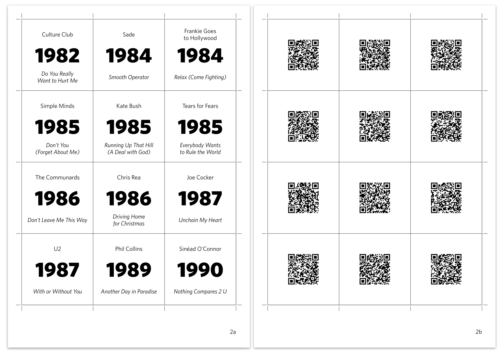

# Hitsgame

Build your own version of the game [Hitster][hitster]. The resulting cards
contain a QR code that point to an audio file on a webserver, no Spotify is
needed to play. The program generates a pdf with cards like this:



## Ingredients

Ingredients:

 * A collection of properly tagged flac files. These files must have the
   `TITLE`, `ARTIST`, and `ORIGINALDATE` or `DATE` tags set.
 * A webserver that can serve static files.
 * Sheets of A4 paper, preferably 180 g/m².
 * Tokens from the original Hitster game, or a suitable replacement,
   e.g. poker chips.

Hardware tools needed:

 * A printer.
 * Preferably a paper cutter, alternatively scissors.

Software tools needed:

 * Either [Nix 2.17.0][nix217], which can provide all the needed packages,
   run with `nix develop --command ./mkhitsgame.py`.
 * Or install manually:
   * Python ≥ 3.11 with `qrcode==7.4.2` and `mutagen` packages.
   * ffmpeg 5.1.3 or n6.1.
   * rsvg-convert (from librsvg) 2.55.1 or 2.57.1.

## Preparation

 1. Create a directory named `tracks` and put the audio files in there that you want
    to include. The script supports `.mp3`, `.flac`, `.m4a`, `.ogg`, and `.wav` files.
 2. Ensure your audio files have proper ID3 tags:
    - **TITLE**: Song title
    - **ARTIST**: Artist name  
    - **ORIGINALDATE** (preferred) or **DATE** or **YEAR**: Release year
 3. Create a file named `mkhitsgame.toml` next to the `tracks` directory, and
    add the configuration as shown in the next section.
 4. Run `mkhitsgame.py`. The script will:
    - Extract metadata from ID3 tags in your audio files
    - Convert each song to a 60-second mono AAC clip at 128kbps
    - Generate hash-based filenames for anonymity
    - Create printable cards with QR codes
    - Print statistics about track distribution over years and decades
 5. You now have two new directories: `build` and your configured output directory 
    (default: `out`). The output directory contains compressed and anonymized MP4 files 
    with no metadata and unguessable filenames, safe for public webserver hosting. 
    `build` contains the PDF with cards and intermediate SVG files.
 6. Upload the contents of your output directory to your webserver.
 7. Print `build/cards.pdf` and cut out the cards.

## Configuration

The `mkhitsgame.toml` file follows the following format:

```toml
# The url prefix that your webserver will serve the track mp4s from.
url_prefix = "https://example.com/"

# Font to use on the cards.
font = "Cantarell"

# Directory where processed songs will be stored.
songs_dir = "out"

# Whether to draw a grid around the cards. If you want to inspect the pdf on
# your computer, or if you are cutting the cards with scissors, you probably
# want to enable this. If you are cutting with a paper cutter, you should
# disable the grid, because if you don't cut *exactly* on the line you'll end
# up with ugly lines on the sides of the cards.
grid = true

# Whether to include crop marks at the sides of the page. If you are cutting
# with a paper cutter, you should enable this to know where to cut.
crop_marks = false
```

For the webserver, you need to configure it to serve the `.mp4` files with
`audio/mp4` MIME type. For Nginx, you can do this using the following snippet:

```nginx
types {
  audio/mp4 mp4;
}
```

## How to play

Refer [the original game rules][howplay] for how to play the game itself. You
do not need to connect Spotify. Scanning a QR code will open the track in your
browser. Most browsers will auto-play the track.

## License

Hitsgame is free software. It is licensed under the
[GNU General Public License][gplv3], version 3.

[gplv3]:   https://www.gnu.org/licenses/gpl-3.0.html
[hitster]: https://boardgamegeek.com/boardgame/318243/hitster
[howplay]: https://hitstergame.com/en-us/how-to-play-premium/
[nix217]:  https://nixos.org/download#nix-more
